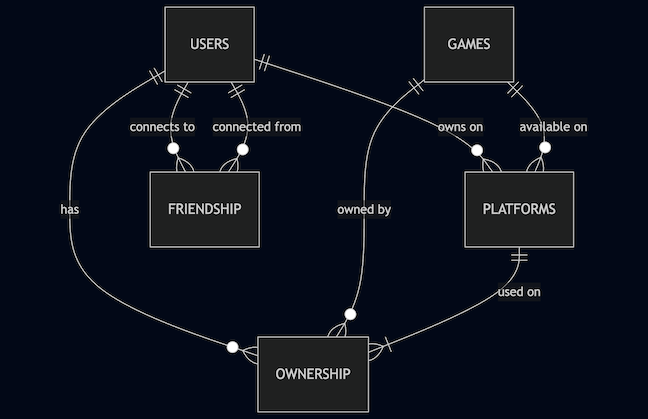

# Video Game Collection Tracker

By Chris Cardi `  `

## Scope

The purpose of this database is to track a personal video game collection.  This database allows users to log the games that they own, the platforms that the games are on, and categorize them by common metadata for organizational purposes.  There is also an option for physical and digital copies, the price they paid for the game and when it was purchased and personally rating the game.  Finally, a user is able to track their friends and view which games they mutually own.

The entities that are within scope are the following:

* Users and their individual libraries
* Video games metadata and their platforms
* Ownership details and personal ratings
* Friendship connections between users
* Mutually owned game lists between friends

Out of scope:

* Multiplayer in-game stats or online features
* Achievements
* Storefront data
* Game playtime tracking `  `

## Functional Requirements

Users should be able to:

* Track games they own
* Track ownership status and details
* Rate games they own
* See what games their friends own

Users should NOT be able to:

* View game completion status
* View in-game statistics
* Write their own personal reviews of the game `  `

## Representation

Entities are captured in SQLite tables with the following schema.

### Entities

The following entities are represented in the database:

### Users

| Entity                 | Description                                                               |
| ---------------------- | ------------------------------------------------------------------------- |
| `id`                 | Unique identifier, INTEGER                                                |
| `username`           | Unique name chosen by the user, TEXT NOT NULL UNIQUE                      |
| `first_name`         | First name of user, TEXT NOT NULL                                         |
| `last_name`          | Last name of user, TEXT NOT NULL                                          |
| `email`              | Contact info, TEXT NOT NULL UNIQUE                                        |
| `account_created_on` | Timestamp of account creation, NUMERIC NOT NULL DEFAULT CURRENT_TIMESTAMP |

### Games

| Entity           | Description                     |
| ---------------- | ------------------------------- |
| `id`           | Unique identifier, INTEGER      |
| `title`        | Name of the game, TEXT NOT NULL |
| `genre`        | Type of game, TEXT              |
| `release_year` | Year game was released, NUMERIC |

### Platforms

| Entity            | Description                                        |
| ----------------- | -------------------------------------------------- |
| `id`            | Unique identifier, INTEGER                         |
| `user_id`       | Who owns the game, INTEGER                         |
| `game_id`       | Which game is owned, INTEGER                       |
| `platform_name` | Name of the platform (e.g. PC, PS5), TEXT NOT NULL |

### Ownership

| Entity            | Description                                                                                     |
| ----------------- | ----------------------------------------------------------------------------------------------- |
| `id`            | Unique identifier, INTEGER                                                                      |
| `user_id`       | Who owns the game, INTEGER                                                                      |
| `game_id`       | Which game is owned, INTEGER                                                                    |
| `platform_id`   | Platform on which game is owned, INTEGER                                                        |
| `purchase_date` | Date game was purchased, NUMERIC                                                                |
| `status`        | owned, borrowed or sold, TEXT NOT NULL CHECK("status" IN "owned", "loaned", "wishlist", "sold") |
| `physical_copy` | Boolean for physical / digital copy, INTEGER CHECK ("physical_copy" IN (0, 1))                  |
| `price_paid`    | How much user paid for the game, NUMERIC CHECK("price_paid" >= 0)                               |
| `rating`        | Rated between 1-10, 1 decimal place, INTEGER CHECK("rating" >= 1 AND "rating" <= 10)            |

### Friendship

| Entity        | Description                     |
| ------------- | ------------------------------- |
| `id`        | Unique identifier, INTEGER      |
| `user_id`   | Who gave the rating, INTEGER    |
| `friend_id` | The friend being added, INTEGER |

 

`INTEGER` type for `PRIMARY KEY`s and for whole numbers for ratings.` `
`TEXT` fields for human-readable data such as titles and names.` `
`DEFAULT` and `CURRENT_TIMESTAMP` for the account creation time.` `
`CHECK` constraints for ensuring valid data.` `
`NUMERIC` for prices.` `
`NOT NULL` constraints for those fields that cannot be empty and need to have a value.` `
`UNIQUE` constraints for those fields that must have a unique value.` `
`FOREIGN KEY` constraints to reference tables and their relationships
`PRIMARY KEY` constraints to help identify entities to their corresponding relationships in other tables.`  `

### Relationships

Entity Relationship Diagram code used:

    USERS ||--o{ PLATFORMS : "owns on"
    USERS ||--o{ OWNERSHIP : "has"
    USERS ||--o{ FRIENDSHIP : "connects to"
    USERS ||--o{ FRIENDSHIP : "connected from"
    GAMES ||--o{ PLATFORMS : "available on"
    GAMES ||--o{ OWNERSHIP : "owned by"
    PLATFORMS ||--|{ OWNERSHIP : "used on"

Entity Diagram:

`  `

## Optimizations

Indices were created to optimize search performance across the following use cases:

* Games a user owns
* Games by title
* Users by full name
* Users by username
* Friend lookups`  `

## Limitations

The limitations of this database does not allow the user to input all the detailed metadata of each individual game.  Only the basic general information is available just to show which game titles are owned on what platforms.  There is also no data for multiplayer, online or social features of the game.

For the sake of this project, it is downscaled A LOT.  At the moment, game addition is created manually.  In the future, it would be fun to integrate actual existing databases of games by the different platforms and import them via CSV.
